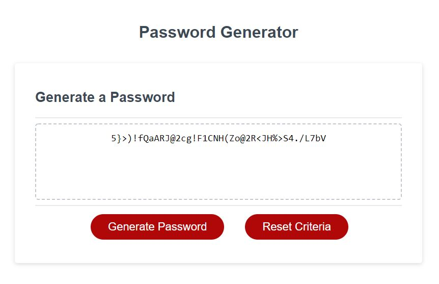

# passwordGenerator

## Description 

In this assignment we are asked to create a passowrd generator. When the site is visted; the user is prompted with a few questions to find the length and criterea of characters for their password. 

---

## Installation

There should be no instillation involved. The link provided should take you straight to the webpage created on default web browser

[I am a link to the web page](https://cheetboy159.github.io/passwordGenerator/)

## Usage 

If you follow the provided link in the installation section, it will take straight to the Horiseon site. The links in the navigation section will take you to the linked sections towards the lower portion of the page. There, you will find more information on these criteria's. 

## License

These files don't have a license and are there to fully share.

---
